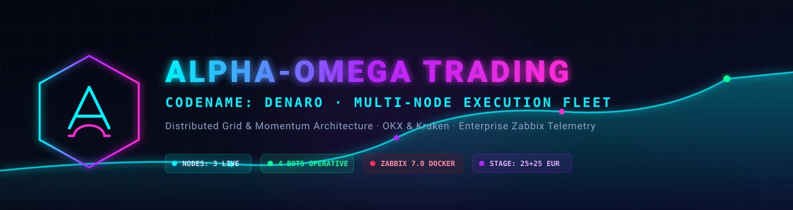

# Alpha-Omega Trading

<p align="center">
  
</p>

<h3 align="center">Flotta di Trading Algoritmico Distribuito & Telemetria ad Alta Frequenza</h3>

<p align="center">
  <i>Motore di esecuzione multi-nodo per OKX e Kraken, protetto da supervisor di rischio, monitoraggio Zabbix in Docker e validazione a scaglioni di capitale.</i>
</p>

<p align="center">
  <a href="https://www.python.org/"></a>
  <a href="https://fastapi.tiangolo.com/"></a>
  <a href="https://www.docker.com/"></a>
  <a href="https://www.zabbix.com/"></a>
  <a href="https://ubuntu.com/"></a>
  <a href="https://www.cloudflare.com/"></a>
  <a href="LICENSE"></a>
</p>

<p align="center">
  <a href="README.md"><b>English</b></a> •
  <a href="README.it.md"><b>Italiano</b></a> •
  <a href="README.es.md"><b>Español</b></a> •
  <a href="README.th.md"><b>ไทย</b></a>
</p>

---

## 🏛 Architettura e Topologia della Flotta Distribuita

Il sistema opera su una topologia multi-host distribuita (`nuvola`, `MARCODG1` e `mc2`). Ogni nodo svolge un ruolo dedicato per garantire esecuzione continua, acquisizione dati e sicurezza senza esposizione di porte in ingresso su reti domestiche dietro CGNAT.

```
 ┌─────────────────────────────────────────────────────────┐
 │                   EXCHANGES LAYER                       │
 │              OKX (EEA)   ·   Kraken REST/WS             │
 └─────────────┬───────────────────────────┬───────────────┘
               │ Esecuzione CCXT           │ Esecuzione CCXT
 ┌─────────────▼─────────────┐ ┌───────────▼───────────────┐
 │       NODO: mc2           │ │      NODO: MARCODG1       │
 │   (Home Node / CGNAT)     │ │        (Cloud VPS)        │
 │ · denaro-node-mc2         │ │ · denaro-node-trend-live  │
 │ · Docker Zabbix Server    │ │ · Zabbix Push Metrics     │
 │ · Dashboard Web (:8913)   │ │ · Aggregator API (:8912)  │
 └─────────────┬─────────────┘ └───────────┬───────────────┘
               │                           │
               └─────────────►◄────────────┘
                 Tunnel SSH Inversi (autossh)
                 Zabbix Trapper :10051 / Reverse 2222
```

### Tecnologie Principali
| Componente | Stack Tecnologico | Funzione |
| :--- | :--- | :--- |
| **Core di Esecuzione** | `Python 3.12`, `AsyncIO`, `CCXT` | Runtime unificato per strategie a griglia e momentum. |
| **Rete e Connettività** | `autossh`, `systemd`, `Cloudflare` | Tunnel SSH inversi cifrati (2222/10051/8912) per superare CGNAT. |
| **Telemetria & Allarmi** | `Zabbix 7.0 LTS`, `Docker`, `PostgreSQL` | Oltre 350 metriche per tracciare equity, PnL e heartbeat di sistema. |
| **Dashboard Real-Time** | `FastAPI` / `HTTP Server`, Neon UI | Stato live del portafoglio e salute dei bot su `web.grivetto.eu`. |

---

## 📖 Storia e la Realtà dei Mercati ("La Baracca")

Il progetto è nato con il soprannome *"La Baracca"* — espressione onesta e colloquiale per indicare un marchingegno fragile, continuamente bisognoso di riparazioni e verifiche, senza spazio per facili entusiasmi.

### Le lezioni del trading reale
Nelle prime fasi, backtest teorici e parametri statici sembravano promettenti. Il confronto con gli exchange reali ha mostrato un quadro ben diverso:
- **Erosione da Commissioni e Slippage:** Le fee maker/taker e lo scostamento degli ordini a mercato possono azzerare i piccoli guadagni di una griglia troppo fitta.
- **Frizioni di Rete e Limiti Normativi:** Riconnessioni forzate, rate limit degli endpoint EEA e manutenzioni degli exchange causavano ordini rifiutati o blocchi non rilevati.
- **Asimmetria dei Trend:** Griglie statiche senza filtri di regime accumulano scorte durante forti discese, portando a trappole di inventario e capitale bloccato.

L'intero sistema è stato perciò reingegnerizzato con **approccio difensivo e modulare**: controlli pre-flight anti-deadlock, isolamento tramite sub-account, monitoraggio continuo di CPU/RAM con safe-mode automatica e circuit breaker.

---

## 🚀 Work in Progress Attivo (Fase Live: 25 + 25 EUR)

L'operatività segue una rigida **roadmap a scaglioni di capitale**. I fondi reali sono mantenuti su un envelope ridotto (~50 EUR complessivi) finché la robustezza statistica non è comprovata:

| Exchange | Coppia | Modalità | Budget | Strategia | Host di Esecuzione | Stato |
| :--- | :--- | :--- | :--- | :--- | :--- | :--- |
| **Kraken** | `SOL/EUR` | **Live** | ~12.70 € | Momentum Capture | `MARCODG1` |  |
| **Kraken** | `XRP/EUR` | **Live** | ~12.70 € | Momentum Capture | `MARCODG1` |  |
| **OKX** | `DOGE/EUR` | **Live** | ~12.00 € | Multi-level Grid | `mc2` (`mc2sub1`) |  |
| **OKX** | `SOL/EUR` | **Live** | ~12.00 € | Multi-level Grid | `mc2` (`mc2sub1`) |  |

### Roadmap a Scaglioni verso i 1.000 EUR
- [x] **Fase 1 (Attuale):** 4 bot live attivi (~50 EUR di budget totale). Finestra di osservazione prolungata su fee reali, esecuzioni e stabilità delle API.
- [ ] **Fase 2:** Incremento a 100 EUR – 250 EUR solo dopo aver consolidato Profit Factor > 1.25 e Drawdown Massimo < 8%.
- [ ] **Fase 3:** Estensione a 500 EUR con spaziatura dinamica calcolata su volatilità storica (ATR).
- [ ] **Fase 4:** Flotta di produzione a regime pieno (1.000 EUR) distribuita sui sub-account dedicati.

---

## 🛡 Controlli di Rischio e Sicurezza

- **Validazione Pre-Flight:** Controlli anti-deadlock verificano saldo libero ed equity prima di inviare ogni singolo ordine a mercato.
- **Supervisor Safe Mode:** Monitoraggio continuo delle risorse (RAM, CPU, lag dei tick). Rallenta o arresta l'engine se vengono superate le soglie critiche.
- **Isolamento Sub-Account:** L'esecuzione live avviene esclusivamente su sub-account dedicati (`TRENDSUB` su Kraken, `mc2sub1` su OKX).
- **Zero Credenziali nel Repository:** Tutte le chiavi API risiedono nei file `.env` locali esclusi dal versionamento Git.

---

## 🛠 Avvio Rapido

### Installazione
```bash
# Clona il repository
git clone git@github.com:grivetto/alpha-omega-trading.git
cd alpha-omega-trading

# Crea ambiente virtuale e installa dipendenze
python3 -m venv venv
source venv/bin/activate
pip install -r requirements.txt

# Configura ambiente
cp .env.example .env
```

### Avvio Nodi
```bash
# Avvia il nodo Kraken trend-following
python -m denaro.denaro_node --config config/node_trend_live_kraken.yaml

# Avvia il nodo OKX grid
python -m denaro.denaro_node --config config/node_mc2.yaml

# Esegui la suite di test
pytest
```

---

## ⚖️ Disclaimer

**Questo software è fornito esclusivamente a scopo didattico, accademico e di ricerca. Non costituisce consulenza finanziaria.** Il trading algoritmico su criptovalute comporta elevati rischi finanziari, inclusa la possibile perdita totale del capitale impiegato. Gli autori non rilasciano alcuna garanzia in merito a profitti o performance. Non operare mai con fondi che non ci si possa permettere di perdere.

---

## 📄 Licenza

Rilasciato nel pubblico dominio tramite Creative Commons Zero (CC0 1.0 Universal). Consulta il file [LICENSE](LICENSE) per tutti i dettagli.
