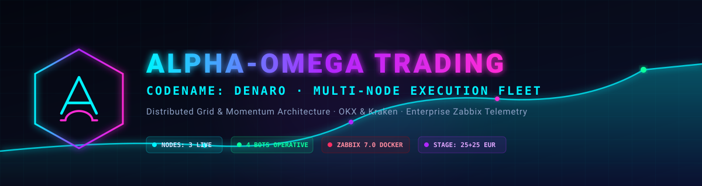
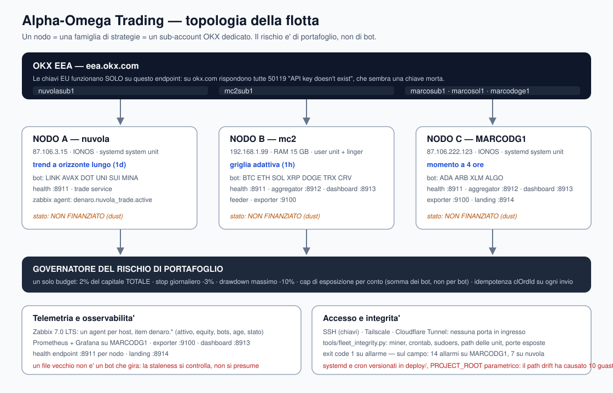
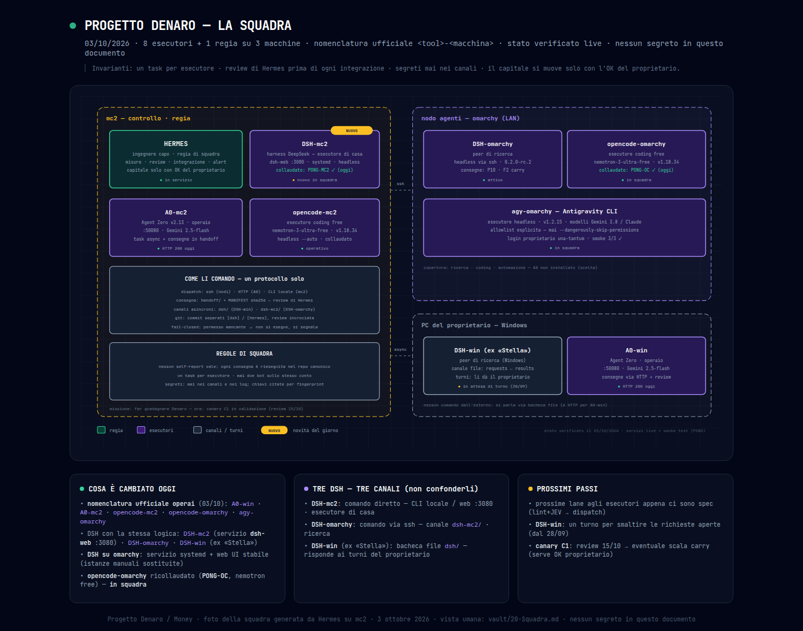

# Alpha-Omega Trading — «Denaro»

<p align="center">
  
</p>

<h3 align="center">Una flotta di trading algoritmico misurata: tre macchine, strategie complementari, sub-account isolati</h3>

<p align="center">
  <i>Motore di esecuzione multi-nodo indipendente su OKX EEA, con budget di rischio rigidi, telemetria onesta e un gate di promozione che nessuna strategia entra in produzione senza aver passato.</i>
</p>

<p align="center">
  <a href="https://www.python.org/"></a>
  <a href="https://www.okx.com/en-eu"></a>
  <a href="https://github.com/ccxt/ccxt"></a>
  <a href="https://www.docker.com/"></a>
  <a href="https://www.zabbix.com/"></a>
  <a href="LICENSE"></a>
</p>

<p align="center">
  <a href="README.md"><b>English</b></a> •
  <a href="README.it.md"><b>Italiano</b></a> •
  <a href="README.es.md"><b>Español</b></a> •
  <a href="README.th.md"><b>ไทย</b></a>
</p>

---

## 📊 Stato in sintesi — aggiornato 2026-10-03

> **La flotta fa trading solo con ciò che passa il cancello — e la prima eccezione live è attiva.** Dal
> 2026-10-01 un **canary** in denaro reale gira su OKX EEA: un carry di funding su DOGE (spot + hedge perp),
> completamente riconciliato, con funding che matura tre volte al giorno (giorno 3/14: funding +0,0076 USDC,
> netto ≈ +0,009 USDC). Tutto il resto gira ancora in paper mentre la ricerca paga il suo pedaggio. Size
> volutamente piccola: è un esperimento, non un raccolto.

| Area | Stato | Evidenza |
| :--- | :--- | :--- |
| **Ordine del repository** | ✅ riconciliato con `origin`, il lavoro di tutte le sessioni committato | commit `[hermes]`/`[dsh]` pushati, `main` allineato (03/10) |
| **Suite di test** | ✅ **finalmente eseguibile** (prima 63 failed / 50 errors, tutti ambientali) — oggi **387 passed, 3 skipped** | vedi § Testing |
| **Idempotenza degli ordini** | ✅ implementata (`clOrdId` su ogni invio, journalato *prima* dell'ordine) | 7 test |
| **Stato non finanziato** | ✅ esplicito `ok` / `sottocapitalizzato` / `non_finanziato` / `illeggibile` | 18 test |
| **Limite di esposizione del conto** | ✅ integrato nel nodo (il registro esisteva, nessuno lo aveva costruito) | 15 test |
| **Controllo di integrità della flotta** | ✅ `tools/fleet_integrity.py`, exit code 1 su qualsiasi allarme | 14 allarmi su MARCODG1, 7 su nuvola |
| **Trading live** | ✅ **un bot live** (carry C1, DOGE): taglia volutamente minima, completamente riconciliato, funding in maturazione (funding +0,0076, netto ≈ +0,009 USDC, giorno 3/14) | la prima esecuzione reale del progetto; il resto: paper + ricerca |
| **Capitale** | ✅ **~1.100 EUR** su OKX (l'owner ha depositato **+1.000 EUR il 03/10**, verificato in sola lettura) | funding wallet; deploy condizionato alla review del 15/10 |
| **Servizi di telemetria** | ✅ sweep pulito sui tre nodi (03/10) + **check post-riavvio 34/34** (`tools/postboot_check.sh`); l'uscita dichiarata del banco (exit 2 = non finanziato) non è più un failure systemd | sweep `systemctl` + drop-in `10-exit2.conf` |
| **Allarmi** | ✅ canale Telegram live (`@DenaroAlertBot`): watchdog su **bot · canary · flotta** (anti-flap su 2 rilevazioni consecutive, messaggio di rientro) + digest 09:00 | iniziativa «zero silenzi» |
| **Squadra & agenti** | ✅ **8 esecutori + 1 regia** su 3 macchine: `A0-win` · `A0-mc2` · `DSH-mc2/omarchy/win` · `opencode-mc2/omarchy` · `agy-omarchy` — ogni consegna rivista da Hermes, test rieseguiti nel repo | vedi § Il livello operativo |
| **Sicurezza** | ⚠️ un host è stato compromesso, ora contenuto | vedi § Sicurezza |
| **Economia** | ⚠️ la fascia commissionale attuale annulla l'edge — vedi § L'economia | misurato su commissioni reali |

---

## 📜 La storia — da «La Baracca» a una flotta misurata

Il progetto era stato soprannominato in origine *«La Baracca»* — un aggeggio improvvisato che ha
sempre bisogno di un'altra toppa. Il nome è invecchiato bene: per un anno è stato esattamente
questo — bot che giravano, numeri che non si riconciliavano, zero euro guadagnati, tra tentativi e
strumenti AI diversi (OpenClaw, Hermes, Agent Zero, DeepSeek TUI). Il punto di svolta non è stata
una feature. È stata una decisione: smettere di costruire, cominciare a misurare — e fare del
misurare un cancello.

| Quando | Cosa è successo | La lezione |
| :--- | :--- | :--- |
| **2026, primavera → estate** | La serie `denaro`: quattro codebase una dopo l'altra — Binance su un telefono, un primo `money` (grid, DCA, scalper, hedge, futures, sentiment), **questo** repository (49.162 righe, 17 bot, tre macchine), `denaro2` sulle VPS | costruire *prima* il sistema e cercare *dopo* qualcosa da catturare non funziona |
| **2026-09** | L'audit (`docs/01`): «il sistema funziona, su una baracca non supervisionata» — servizi non versionati, capitali che i conti non avevano, 1.486 tick persi in silenzio, 10 guasti su 12 da un solo path obsoleto | fermarsi; rifondare |
| **2026-09-23 → 30** | La rifondazione: tre nodi = tre famiglie = tre conti; il rischio diventa una proprietà di portafoglio (2% / −3% / −10%); il **cancello a 8 criteri** diventa codice; gli esperimenti sono pre-registrati e giudicati uno a uno | il cancello non è una linea guida: è codice, e il suo rifiuto è vincolante |
| **2026-10-01** | **Il primo ordine reale del progetto** viene eseguito su OKX EEA; nasce il **canary C1** (carry di funding DOGE) — taglia minima, completamente riconciliato | un esperimento, non un raccolto |
| **2026-10-03** | L'owner deposita **+1.000 EUR**; la flotta guadagna i suoi agenti (`DSH`, `A0`, `opencode`, `agy`), l'alerting live e il check post-riavvio (34/34) | il capitale non crea l'edge — rende *visibile* il guadagno |

Le codebase vecchie vivono nel repository gemello [`money`](https://github.com/grivetto/money) —
`legacy/`, tracciate con la loro storia, memoria e non fondamenta. La ricerca accade lì; **niente
arriva in produzione senza passare il cancello.**

---

## 🏛 Topologia della flotta

Il sistema gira su tre host, ognuno un **nodo indipendente: una macchina = una famiglia di strategie =
un sub-account OKX**. Non è una scelta stilistica — è la correzione di tre difetti che erano stati
osservati in produzione (vedi § Lezioni).

```
 ┌──────────────────────────────────────────────────────────────┐
 │                  LIVELLO EXCHANGE — OKX EEA                  │
 │      (le chiavi EU funzionano solo contro eea.okx.com)       │
 └───────┬──────────────────┬──────────────────┬────────────────┘
         │                  │                  │
 ┌───────▼────────┐ ┌───────▼────────┐ ┌───────▼──────────────┐
 │ NODO A         │ │ NODO B         │ │ NODO C               │
 │ nuvola         │ │ mc2            │ │ MARCODG1             │
 │ TREND (giorn.) │ │ GRID adattiva  │ │ 4H momentum          │
 │ sub: nuvolasub1│ │ sub: mc2sub1   │ │ sub: marcosub1       │
 │ edge MISURATO  │ │ gate: da       │ │ gate: servono fee    │
 │                │ │ misurare       │ │ sotto 0.30% per lato │
 └────────────────┘ └────────────────┘ └──────────────────────┘
         │                  │                  │
         └──────────────────┴──────────────────┘
                            │
              ┌─────────────▼──────────────┐
              │ REGIA RISCHIO PORTAFOGLIO  │
              │ un budget: 2% del capitale │
              │ stop −3%/giorno, DD −10%   │
              └────────────────────────────┘
```

**Tre regole non negoziabili:**

1. **Un conto per strategia.** Nessun bot condivide un sub-account con una strategia diversa.
2. **Il rischio è una proprietà del portafoglio, non del singolo bot.** Il budget del 2% è sul capitale
   *totale*. Sette bot che dichiaravano ciascuno l'intero conto rischiavano **il 14% del conto, non il 2%** —
   misurato da `tools/audit_capitale_config.py`.
3. **Nessuna strategia entra in produzione senza passare il gate**: expectancy netta positiva
   out-of-sample, ai costi *reali* del conto su cui gira.

<p align="center">
  
</p>

### Il livello operativo — le stesse macchine, secondo ruolo (rev. 03/10/2026)

Una macchina = una famiglia di strategie = un sub-account è il disegno *di trading*. Le stesse
tre macchine reggono anche tutto ciò che costruisce, osserva e protegge la flotta: un hub, una
sala operativa e un posto di monitoraggio.

```
               ┌──────────────────── OKX EEA (eea.okx.com) ─────────────────────┐
               │ live: 1 canary carry (DOGE) · il resto: paper — zero ordini    │
               └────────────────────────▲──────────────────────▲────────────────┘
                           ordini       │                      │  dati di mercato / API pubblica
 ┌─────────────────────────────────────┴──┐  ┌───────────────┴───────────────────┐
 │ mc2 — hub e officina                   │  │ MARCODG1 — sala operativa         │
 │ · Hermes — direzione, codice, review   │  │ · aggregator :8912 → 34 bot       │
 │ · fabbrica master — azione ogni 3 s    │  │ · dashboard :8913 · landing :8914 │
 │ · Zabbix 7.0 (Docker) + alert          │  │ · Grafana :3000 · health :8911    │
 │ · A0-mc2 operaio · DSH-mc2 (dsh-web)   │  │ · canary (live) · banco a secco   │
 │ · fabbrica worker — ogni 5 s           │  │ · fabbrica worker — ogni 5 s      │
 └────────────────────────────────────────┘  └───────────────────────────────────┘
 ┌────────────────────────────────────────┐
 │ nuvola — posto di monitoraggio         │
 │ · health :8911 · exporter :9100        │
 │ · Zabbix agent + tunnel → mc2          │
 │ · fabbrica worker — ogni 5 s           │
 └────────────────────────────────────────┘
 ┌────────────────────────────────────────┐
 │ nodo agenti (Omarchy, LAN) — agenti    │
 │ · DSH-omarchy — harness + dsh-web      │
 │ · opencode-omarchy · agy-omarchy       │
 └────────────────────────────────────────┘
   telemetria: flotta paper (simulata, su tutti e tre i nodi) → aggregator → dashboard + landing →
   Zabbix «Money» (38 host — bot, macchine, progetto; auto-heal sui guasti noti)
```

**Il bot live** — dal 01/10 un bot reale opera su OKX EEA: carry **C1** (DOGE spot + short
X-Perp, 1× isolated, taglia volutamente minima), completamente riconciliato con l'exchange; il
funding matura tre volte al giorno (00/08/16 UTC) e il netto è leggermente positivo (giorno 3/14:
funding +0,0076 USDC, netto ≈ +0,009 USDC). La finestra di validazione di 14 giorni chiude il
**15/10** con criteri pre-dichiarati (`docs/16`). È la **prima esecuzione reale** del progetto: il
resto resta paper + ricerca.

Il **03/10** l'owner ha depositato **+1.000 EUR** (funding wallet OKX, verificato in sola
lettura: +1.000,00 esatti) per la scala del carry — deploy subordinato alla review del **15/10**.


*Visual a piena risoluzione: [`FOTO_SISTEMA_2026-10-03.html`](https://github.com/grivetto/money/blob/main/FOTO_SISTEMA_2026-10-03.html) · squadra: [`FOTO_SQUADRA_2026-10-03.html`](https://github.com/grivetto/money/blob/main/FOTO_SQUADRA_2026-10-03.html) (repo gemello `money`).*

**In pratica** — il lavoro scorre in un unico anello con una piccola squadra di esecutori: due operai
Agent Zero (`A0-mc2` e `A0-win` sul PC), tre istanze DSH (`DSH-mc2`, `DSH-omarchy` peer di ricerca,
`DSH-win` peer storico), esecutori OpenCode gratuiti (`opencode-mc2`, `opencode-omarchy`) e
`agy-omarchy` (Antigravity) — più il **nodo agenti** (Omarchy, LAN), collegato allo stesso canale e
anello di review. Ogni consegna è ri-verificata da Hermes con i test rieseguiti nel repository prima
che qualcosa entri; la ricerca vive nel repo gemello [`money`](https://github.com/grivetto/money):
idea → spec pre-registrata → esecutore → review → misura → cancello a 8 criteri → promozione o
archivio → banco a secco → canary → live a taglia minima. Heartbeat e controlli di freschezza
coprono ogni daemon critico: il tick della fabbrica e gli shard dei nodi sono sorvegliati, e Zabbix
auto-ripara i guasti noti mentre alza gli altri.



### Tecnologie principali

| Componente | Tecnologia | Funzione |
| :--- | :--- | :--- |
| **Linguaggio / runtime** | Python 3.12+, AsyncIO | event loop del nodo, policy, supervisor |
| **Accesso all'exchange** | CCXT 4.x — OKX EEA REST **e** WebSocket (`ccxt.pro`), hostname **`eea.okx.com`** | dati di mercato e routing degli ordini; le chiavi EU funzionano *solo* contro l'endpoint EEA |
| **Core di esecuzione** | Python, AsyncIO, CCXT | Policy (trend / grid adattiva / mean-reversion), ciclo di vita degli ordini, contabilizzazione dei fill |
| **Core di rischio** | Moduli di dominio puri, nessun I/O | Rischio per operazione, circuit breaker, limite di esposizione del conto, classificazione del finanziamento |
| **Backtest** | Motore proprio, consapevole di commissioni e slippage | Lo stesso codice decisionale del live: un solo rig per entrambi |
| **Operazioni di flotta** | systemd (unit di sistema + utente, `linger`), SSH, Tailscale, Cloudflare Tunnel | Nessuna esposizione in ingresso; telemetria solo su loopback |
| **Telemetria** | Zabbix 7.0 LTS (un agent per host), Prometheus, Grafana, endpoint di health | Curve di equity, salute dei tick, badge di obsolescenza |
| **Integrità** | `tools/fleet_integrity.py` + `tools/postboot_check.sh` | Controlli su miner / crontab / sudoers / path delle unit / porte, con exit code; verifica post-riavvio in un comando (34 check) |
| **Packaging** | Docker + `docker-compose`, `venv`, `requirements.txt` | Ambienti riproducibili su tre host |
| **Qualità** | pytest (**387 passed, 3 skipped**), ruff | Una suite eseguibile è la precondizione per verificare qualsiasi cosa |
| **CI** | GitHub Actions | lint e test a ogni push |
| **Configurazione e segreti** | Config di nodo YAML, un `.env_<node>` per nodo (mode 600, in gitignore) | Un conto per nodo, isolato tramite `env_prefix` |
| **Controllo di versione** | git, un solo writer per path | Provenienza: chi ha cambiato cosa, e quando |

---

## 🧪 Testing — e perché è stata la correzione più grande di questo ciclo

```bash
python -m pytest denaro/tests -q      # 387 passed, 3 skipped
```

Per settimane la suite ha riportato **63 failed e 50 errors**. Quasi nessuno di essi era un difetto di
codice: erano **errori di permessi dell'ambiente**. La causa radice, isolata con tre sonde dirette:

```
os.makedirs(<repo>/.pytmp/probe) + write   -> OK
tempfile.mkdtemp()               + write   -> PermissionError
os.makedirs(...) + open(...)     -> OK
```

`tempfile.mkdtemp` viene rifiutato mentre `os.makedirs` funziona — e sia `TemporaryDirectory` sia
`tmp_path` di pytest passano da lì. La conseguenza era il danno vero: **due sessioni di lavoro
indipendenti non potevano verificare nulla**, e una suite il cui risultato è rumore non può proteggere
nulla. `denaro/tests/conftest.py` ora lo sostituisce alla radice: il risultato è passato da *63 failed /
50 errors* a **1 fallimento reale**, che è un gap semantico noto (vedi § Lavoro aperto).

---

## 💰 L'economia — detta senza giri di parole

Il numero decisivo non è la strategia, è il pedaggio. Misurato dalle pagine ufficiali delle commissioni di OKX EEA:

| conto | maker | taker | round trip | edge lordo di break-even per operazione |
| :--- | :--- | :--- | :--- | :--- |
| OKX EEA **senza** derivati (oggi) | 0,200% | **0,350%** | **0,700%** | **0,70%** |
| OKX EEA **con** X-Perps aperti | 0,080% | **0,100%** | **0,200%** | 0,20% |

Aprire un conto derivati su OKX EEA **non** richiede volume né capitale — solo KYC più una
*valutazione di appropriatezza*. Sposta il conto dalla tabella dello 0,35% a quella dello 0,10%.

**E una correzione che circolava da giorni:** il `−1,97%` del trend daily è un **alpha cumulato su 2,4
anni**, non un rendimento giornaliero. A costo zero il segnale è significativo (t = +4,51); a 0,35% per
lato è **indistinguibile da zero** (t = −0,30). Non è una strategia che sanguina — è una strategia che il
pedaggio cancella.

Le due leve che moltiplicano davvero:

- **abbassare il pedaggio** — da 0,70% a 0,20% per round trip, il che moltiplica per 3,5× la frequenza sostenibile;
- **alzare la frequenza** — la famiglia 4H passa da 3/24 a 18/24 configurazioni robuste alla stessa
  commissione più bassa, cioè ~8× le opportunità.

Nessuna delle due è codice. Una è una valutazione; l'altra è la sua conseguenza.

---

## 🛡 Gestione del rischio

- **Rischio per operazione** — 2% del capitale, fissato in configurazione e pubblicato nell'health.
- **Circuit breaker** — stop giornaliero a −3%, drawdown massimo a −10%, persistiti attraverso i riavvii.
- **Limite di esposizione del conto** — la *somma* di tutti i bot sullo stesso sub-account, non per bot.
- **Classificazione del finanziamento** — un nodo senza capitale dichiara `NON FINANZIATO` una volta per
  transizione, non piazza ordini e non inquina mai le baseline di picco / giornaliere / settimanali. Esce
  dallo stato da solo quando arrivano i fondi, senza un riavvio.
- **Idempotenza degli ordini** — ogni invio porta un `clOrdId`, journalato *prima* che l'ordine parta; un
  ordine che sopravvive a un crash viene riconosciuto come nostro al riavvio invece di essere contato come
  sconosciuto.
- **Semantica dello stop** — lo stop vende la quota del bot stesso (`tracked size + bought-not-resold`),
  mai il saldo libero del conto: con due bot su un sub-account, il vecchio comportamento liquidava
  l'inventario di un altro bot.
- **Supervisor** — la pressione su RAM/CPU limita gli intervalli dei tick (`nominal` → `caution` → `safe` →
  `emergency`).

---

## 🔒 Sicurezza — un host è stato compromesso, ora contenuto (2026-09-25)

Un audit della flotta ha trovato un **cryptominer di terze parti** su MARCODG1: un binario ELF in
`/var/tmp/.X11-unix-socket/`, in esecuzione come utente di servizio `zabbix` per **4 giorni**, 199% di CPU
e 2,1 GB di RAM, con persistenza via cron e una connessione attiva a un mining pool. È stata la causa
diretta dell'oscillazione `SafeMode safe ↔ caution` del nodo live (RAM all'87%).

Contenimento, con copie forensi fatte **prima** di qualsiasi cancellazione:

| azione | esito verificato |
| :--- | :--- |
| processo terminato | nessun PID, 0 connessioni al pool |
| RAM | utilizzata **3114 → 1003 MB** |
| persistenza cron | rimossa (spool verificato su disco) |
| binario | `chmod 000` + copia in `/root/quarantena_miner_20260925/` |
| regola `sudo` orfana per `zabbix` | rimossa → *not allowed to run sudo* |
| `AllowKey=system.run[*]` | disabilitato su **entrambi** gli host |

**Chiuso nel frattempo (2026-10-01):** credenziali Zabbix ruotate; frontend di monitoring dietro Cloudflare Access; segreti in chiaro rimossi da questo repository. **Ancora aperto per il proprietario:** revocare il PAT GitHub trovato in chiaro nella history di una shell;
decidere se ricostruire l'host compromesso; rigenerare il key vault (7
chiavi OKX su 7 sono morte); rivedere il firewall (`ufw` inattivo, `5432` e `10050` esposte).

---

## 📚 Lezioni («La Baracca»)

Il progetto era stato soprannominato in origine *«La Baracca»* — italiano per un aggeggio improvvisato che
ha sempre bisogno di un'altra toppa. Il nome è invecchiato bene. Cosa hanno insegnato i mercati live, in
ordine di costo:

1. **Il capitale frammentato va in stallo.** Saldi piccoli sparsi su molti sub-account, ognuno con ordini
   aperti, riducono a zero il saldo libero.
2. **Il pedaggio non è un dettaglio.** Commissioni e slippage cancellano in silenzio edge che i backtest
   mostrano comodamente.
3. **Ogni bot che dichiara l'intero conto moltiplica il rischio per N.** Sette bot × 2% = 14%.
4. **Una guardia senza stato è un fallimento silenzioso.** 1.486 tick saltati sono sembrati «non è
   successo nulla» per ore, perché nessuno stato diceva «non sono finanziato».
5. **Gli ordini non tracciati dopo un crash sono denaro invisibile.** Da qui le chiavi di idempotenza.
6. **Una telemetria che si legge come un fossile è peggio di nessuna telemetria.** I file di health
   obsoleti contano come «running» a meno che qualcosa non ne controlli esplicitamente l'età.
7. **Il path drift in produzione rompe tutto insieme.** Dieci delle dodici unit rotte condividevano una
   sola causa radice: un percorso di progetto obsoleto nelle unit systemd e nei crontab che non sono mai
   stati versionati.

---

## 🛠 Avvio rapido

```bash
git clone git@github.com:grivetto/alpha-omega-trading.git
cd alpha-omega-trading
python3 -m venv venv && source venv/bin/activate
pip install -r requirements.txt

cp .env.example .env         # le credenziali restano in locale: mai committare segreti

# controllo di integrità della macchina (read-only, exit code 1 su allarme)
python tools/fleet_integrity.py
python tools/fleet_integrity.py --host nuvola --host MARCODG1 --host mc2

# verifica post-riavvio (34 check su tutti i nodi)
bash tools/postboot_check.sh

# test
python -m pytest denaro/tests -q

# un nodo
python -m denaro.denaro_node --config config/node_nuvola_trade.yaml

# backtest onesto contro commissioni reali
python -m denaro.backtest --config config/node_nuvola_trade.yaml --days 60 --fee 0.0035
```

---

## 🚧 Lavoro aperto, in ordine di valore

1. **Review del canary C1 — 15/10.** La finestra di validazione di 14 giorni chiude con criteri
   pre-registrati (`docs/16`); con esito positivo parte subito la scala multi-coppia del carry —
   piano scritto e pronto (`money/docs/20`), subordinato all'OK dell'owner.
2. **Il primo edge promosso manca ancora — è il titolo onesto.** Ogni famiglia di strategie
   misurata finora è archiviata; la tesi viva (carry di funding) è in validazione, non ancora
   promossa. La ricerca continua nel repo gemello (registro serie P, release di validazione M1).
3. **Backlog DSH-win**: alcune richieste attendono un turno dell'owner sul peer Windows (canale
   file `hermes_bridge/dsh/`).
4. **Gap minori noti, tenuti onesti:** registrazione del fill del grid (dietro dal 25/09); i test
   async girano ancora attraverso un meccanismo non documentato.
5. **Tenere l'officina tale:** tutto ciò che si riavvia ha un check
   (`tools/postboot_check.sh`, verificato 34/34 post-riavvio), e tutto ciò che si rompe ha un
   allarme (`@DenaroAlertBot`, watchdog su bot · canary · flotta).

## 🗺 Percorso di scalabilità

La struttura è identica a ogni scala: **un nodo = una strategia = un conto**. Quello che cambia è il
*numero di nodi*, non il numero di strategie stipate su un conto. Stiparle insieme è l'esperimento già
fatto — e ha prodotto il 14% di rischio aggregato, bot che si fermano a vicenda sull'equity condiviso, e
uno stop che liquidava l'inventario di un altro bot.

- [x] **Ora:** repository in ordine, tre difetti critici chiusi con prove, controllo di integrità
      operativo, suite eseguibile, infrastruttura versionata (`deploy/`).
- [x] **Poi:** il gate sulle commissioni — derivati aperti su OKX EEA (`acctLv 2`); il tooling è
      di nuovo in condizione di usarli.
- [x] **2026-10-03:** l'owner ha depositato **+1.000 EUR**; il capitale è pronto, il deploy è
      subordinato alla review del canary del **15/10**.
- [ ] **Prossimo:** il primo edge promosso fuori campione — tutto il resto lo sta già aspettando.

---

## ⚖️ Disclaimer

**Questo software è distribuito esclusivamente per scopi didattici, accademici e di ricerca. Non
costituisce consulenza finanziaria né di investimento.** Il trading algoritmico su criptovalute comporta
un rischio finanziario sostanziale, inclusa la possibile perdita di tutto il capitale investito. Gli
autori non rilasciano alcuna dichiarazione o garanzia riguardo alla redditività o alle prestazioni del
sistema. Non fare mai trading con capitale che non puoi permetterti di perdere.

---

## 📄 Licenza

Rilasciato sotto la **European Union Public Licence v. 1.1 (EUPL-1.1)**. Vedi [LICENSE](LICENSE).
